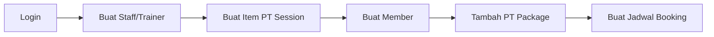

# Panduan End-to-End: Mengatur Jadwal untuk Member

Dokumen ini menjelaskan langkah-langkah lengkap untuk mengatur jadwal (scheduling) bagi member di aplikasi ERP Monorepo. Panduan ini dimulai dari database kosong tanpa data apapun.

---

## Ringkasan Alur Data



---

## Langkah 1: Login ke Aplikasi

### Menu yang Diakses
- Halaman: **Login** (`/login`)

### Nilai yang Harus Diisi
| Field | Nilai | Keterangan |
|-------|-------|------------|
| Email | `admin@gym.com` | Email admin default |
| Password | `password123` | Password default |

### Catatan
- Pastikan API server berjalan di `localhost:3001`
- Pastikan Web server berjalan di `localhost:3000`
- Gunakan command: `pnpm dev` dari root folder

---

## Langkah 2: Buat Staff (Trainer)

> [!IMPORTANT]
> Trainer **WAJIB** dibuat terlebih dahulu karena jadwal booking memerlukan trainer.

### Menu yang Diakses
1. Sidebar: **Organization** → **People** (`/people`)
2. Klik tombol **"New Person"** atau akses `/people/new`

### Nilai yang Harus Diisi

| Field | Nilai Contoh | Wajib? | Keterangan |
|-------|--------------|--------|------------|
| **Type** | `STAFF` | ✅ Ya | Pilih STAFF untuk trainer |
| **Full Name** | `John Trainer` | ✅ Ya | Nama lengkap trainer |
| **Email** | `john@gym.com` | ❌ Opsional | Email trainer |
| **Phone** | `081234567890` | ❌ Opsional | Nomor telepon |
| **Department** | *(pilih dari dropdown)* | ❌ Opsional | Departemen trainer |
| **Status** | `ACTIVE` | Default | Status aktif |

### Screenshot Fields

```
┌─────────────────────────────────────────────────────────┐
│ Create New Person                                       │
├─────────────────────────────────────────────────────────┤
│ Type:        [STAFF ▾] ← Pilih STAFF untuk trainer      │
│ Full Name:   [John Trainer] ← Wajib diisi              │
│ Email:       [john@gym.com] ← Opsional                 │
│ Phone:       [081234567890] ← Opsional                 │
│ Department:  [Training Dept ▾] ← Opsional              │
│ Status:      [ACTIVE ▾] ← Default sudah aktif          │
│                                                         │
│              [Cancel]  [Create Person]                  │
└─────────────────────────────────────────────────────────┘
```

---

## Langkah 3: Buat Item PT Session

> [!IMPORTANT]
> Item dengan **Service Kind = PT_SESSION** diperlukan untuk membuat PT Package.

### Menu yang Diakses
1. Sidebar: **Inventory & Sales** → **Items** (`/catalog/items`)
2. Klik tombol **"New Item"** atau akses `/catalog/items/new`

### Nilai yang Harus Diisi

| Field | Nilai Contoh | Wajib? | Keterangan |
|-------|--------------|--------|------------|
| **Type** | `SERVICE` | ✅ Ya | Pilih SERVICE untuk layanan |
| **Service Kind** | `PT_SESSION` | ✅ Ya | Pilih PT_SESSION untuk Personal Training |
| **Name** | `10 PT Sessions` | ✅ Ya | Nama paket PT |
| **Code** | *(auto-generated)* | Auto | Kode item otomatis |
| **Price** | `1500000` | ✅ Ya | Harga dalam Rupiah |
| **Session Count** | `10` | ✅ Ya | Jumlah sesi yang termasuk |
| **Duration Value** | `3` | ❌ Opsional | Durasi validitas paket |
| **Duration Unit** | `MONTH` | ❌ Opsional | Unit durasi (DAY/WEEK/MONTH/YEAR) |
| **Status** | `ACTIVE` | Default | Status aktif |

### Screenshot Fields

```
┌─────────────────────────────────────────────────────────┐
│ Create New Item                                         │
├─────────────────────────────────────────────────────────┤
│ Type:           [SERVICE ▾] ← Pilih SERVICE            │
│ Service Kind:   [PT_SESSION ▾] ← Pilih PT_SESSION      │
│ Name:           [10 PT Sessions] ← Nama paket          │
│ Code:           [ITM-0001] ← Auto-generated            │
│ Price:          [1500000] ← Harga dalam Rupiah         │
│ Session Count:  [10] ← Jumlah sesi                     │
│ Duration Value: [3] ← Validitas paket                  │
│ Duration Unit:  [MONTH ▾] ← Unit validitas             │
│ Category:       [Select... ▾] ← Opsional               │
│ Description:    [Paket 10x latihan personal training]  │
│ Status:         [ACTIVE ▾]                             │
│                                                         │
│              [Cancel]  [Create Item]                    │
└─────────────────────────────────────────────────────────┘
```

> [!TIP]
> **Pilihan Service Kind:**
> - `MEMBERSHIP` - Untuk paket membership bulanan/tahunan
> - `PT_SESSION` - Untuk paket Personal Training (wajib untuk scheduling)

---

## Langkah 4: Buat Member

### Menu yang Diakses
1. Sidebar: **Member Management** → **Members** (`/members`)
2. Klik tombol **"New Member"** atau akses `/members/new`

### Nilai yang Harus Diisi

Member dapat dibuat dengan **2 cara**:

#### Opsi A: Dari Person yang Sudah Ada

| Field | Nilai Contoh | Wajib? | Keterangan |
|-------|--------------|--------|------------|
| **Tab** | `Existing Person` | - | Pilih tab ini |
| **Search Person** | `(nama person)` | ✅ Ya | Cari dari daftar people |
| **Agreed to Terms** | `✓` (centang) | ❌ Opsional | Persetujuan terms |
| **Notes** | `Member baru` | ❌ Opsional | Catatan |

#### Opsi B: Buat Person Baru

| Field | Nilai Contoh | Wajib? | Keterangan |
|-------|--------------|--------|------------|
| **Tab** | `New Person` | - | Pilih tab ini |
| **Full Name** | `Budi Member` | ✅ Ya | Nama lengkap member |
| **Email** | `budi@email.com` | ❌ Opsional | Email member |
| **Phone** | `085678901234` | ❌ Opsional | Nomor telepon |
| **Agreed to Terms** | `✓` (centang) | ❌ Opsional | Persetujuan terms |
| **Notes** | `Customer VIP` | ❌ Opsional | Catatan |

### Screenshot Fields

```
┌─────────────────────────────────────────────────────────┐
│ Create New Member                                       │
├─────────────────────────────────────────────────────────┤
│ ┌──────────────────┬──────────────────┐                │
│ │ Existing Person  │   New Person     │ ← Pilih tab   │
│ └──────────────────┴──────────────────┘                │
│                                                         │
│ [Tab: New Person]                                       │
│ Full Name:  [Budi Member] ← Wajib                      │
│ Email:      [budi@email.com] ← Opsional                │
│ Phone:      [085678901234] ← Opsional                  │
│                                                         │
│ ☑ Agrees to Terms & Conditions                         │
│                                                         │
│ Notes:                                                  │
│ ┌─────────────────────────────────────────────────┐    │
│ │ Member baru, perlu orientasi                    │    │
│ └─────────────────────────────────────────────────┘    │
│                                                         │
│              [Cancel]  [Create Member]                  │
└─────────────────────────────────────────────────────────┘
```

### Hasil
Setelah member dibuat, sistem akan otomatis generate:
- **Member Code** (contoh: `MBR-0001`)
- **Status**: `NEW`
- **Member Since**: *(kosong sampai ada membership aktif)*

---

## Langkah 5: Tambah PT Package untuk Member

> [!WARNING]
> PT Package **WAJIB** ditambahkan sebelum bisa membuat booking jadwal untuk member.

### Menu yang Diakses
1. Dari halaman Members (`/members`), klik nama member
2. Di halaman detail member (`/members/[id]`), scroll ke bagian **"PT Packages"**
3. Klik tombol **"Add PT Package"**

### Nilai yang Harus Diisi

| Field | Nilai Contoh | Wajib? | Keterangan |
|-------|--------------|--------|------------|
| **PT Item** | `10 PT Sessions` | ✅ Ya | Pilih dari dropdown item PT_SESSION |
| **Trainer** | `John Trainer` | ✅ Ya | Pilih trainer dari dropdown |
| **Total Sessions** | *(auto dari item)* | ✅ Ya | Otomatis terisi dari item |
| **Start Date** | `2026-02-06` | ✅ Ya | Tanggal mulai berlaku |
| **Expiry Date** | `(suggested + 3 bulan)` | ❌ Opsional | Tanggal kadaluarsa |
| **Price Paid** | *(auto dari item)* | ✅ Ya | Harga yang dibayar |
| **Notes** | `Diskon 10%` | ❌ Opsional | Catatan khusus |

### Screenshot Fields

```
┌─────────────────────────────────────────────────────────┐
│ Add PT Package                                          │
├─────────────────────────────────────────────────────────┤
│ PT Item:                                                │
│ [10 PT Sessions (10 sessions - $1,500,000) ▾]          │
│                                                         │
│ Trainer:                                                │
│ [John Trainer ▾]                                       │
│                                                         │
│ Total Sessions:  [10] ← Auto dari item                 │
│ Start Date:      [2026-02-06] ← Input tanggal          │
│                                                         │
│ Expiry Date (Optional):                                │
│ [____________________] [No expiry]                     │
│ ℹ️ Suggested: 06 May 2026 (based on item duration)      │
│                                                         │
│ Price Paid ($):  [1500000] ← Bisa diubah               │
│ ⚠️ Custom price applied (Original: $1,500,000)         │
│                                                         │
│ Notes:                                                  │
│ ┌─────────────────────────────────────────────────┐    │
│ │ Manual PT package untuk member VIP              │    │
│ └─────────────────────────────────────────────────┘    │
│                                                         │
│              [Cancel]  [Add PT Package]                 │
└─────────────────────────────────────────────────────────┘
```

### Hasil
Setelah PT Package dibuat:
- **Status**: `ACTIVE`
- **Remaining Sessions**: 10 (sesuai total)
- **Used Sessions**: 0

---

## Langkah 6: Buat Jadwal Booking

### Menu yang Diakses
1. Sidebar: **Member Management** → **Scheduling** (`/scheduling`)
2. Pilih trainer dari **"Trainers:"** list
3. Klik slot waktu kosong pada kalender, ATAU klik tombol di UI

### Cara Membuat Booking

#### Metode 1: Klik Tombol "New Booking" (Disarankan)
1. Di halaman Scheduling, klik tombol **"New Booking"** di pojok kanan atas.
2. Dialog "Create New Booking" akan muncul.

#### Metode 2: Klik Slot di Kalender
1. Pilih trainer di bagian atas.
2. Klik slot waktu yang tersedia (berwarna hijau muda) di kalender mingguan.
3. Dialog "Create New Booking" akan muncul.

> [!TIP]
> Slot kalender hanya bisa diklik jika trainer memiliki jadwal ketersediaan (availability). Jika slot terlihat abu-abu, gunakan **Metode 1**.

### Nilai yang Harus Diisi

| Field | Nilai Contoh | Wajib? | Keterangan |
|-------|--------------|--------|------------|
| **Date** | `2026-02-10` | ✅ Ya | Tanggal booking |
| **Start Time** | `09:00` | ✅ Ya | Jam mulai |
| **Trainer** | `John Trainer` | ✅ Ya | Pilih dari dropdown |
| **Member** | `Budi Member (MBR-0001)` | ✅ Ya | Cari dan pilih member |
| **Type** | `PT_SESSION` | ✅ Ya | Tipe booking |
| **Duration (min)** | `60` | ✅ Ya | Durasi dalam menit |
| **PT Package** | `10 PT Sessions (10 left)` | ✅ Ya | Pilih paket PT aktif |
| **Notes** | `Fokus upper body` | ❌ Opsional | Catatan sesi |

### Screenshot Fields

```
┌─────────────────────────────────────────────────────────┐
│ Create New Booking                                      │
├─────────────────────────────────────────────────────────┤
│ Date:           [2026-02-10]      Start Time: [09:00]  │
│                                                         │
│ Trainer:                                                │
│ [John Trainer ▾]                                       │
│                                                         │
│ Member:                                                 │
│ [🔍 Search by name or code...]                         │
│ ┌─────────────────────────────────────────────────┐    │
│ │ Budi Member (MBR-0001) ← Klik untuk pilih       │    │
│ └─────────────────────────────────────────────────┘    │
│                                                         │
│ Type:           [PT Session ▾]   Duration: [60] min    │
│                                                         │
│ PT Package:                                             │
│ [10 PT Sessions (10 sessions left) ▾]                  │
│                                                         │
│ Notes:                                                  │
│ ┌─────────────────────────────────────────────────┐    │
│ │ Fokus upper body, bring water                   │    │
│ └─────────────────────────────────────────────────┘    │
│                                                         │
│              [Cancel]  [Create Booking]                 │
└─────────────────────────────────────────────────────────┘
```

> [!NOTE]
> **Jika PT Package tidak muncul:**
> - Pastikan member sudah memiliki PT Package dengan status `ACTIVE`
> - Pastikan `remainingSessions > 0`
> - Lihat kembali Langkah 5

---

## Ringkasan Menu dan Navigasi

| No | Langkah | Menu Sidebar | URL |
|----|---------|--------------|-----|
| 1 | Login | - | `/login` |
| 2 | Buat Trainer | Organization → People | `/people/new` |
| 3 | Buat Item PT | Inventory & Sales → Items | `/catalog/items/new` |
| 4 | Buat Member | Member Management → Members | `/members/new` |
| 5 | Tambah PT Package | *(dari detail member)* | `/members/[id]` |
| 6 | Buat Booking | Member Management → Scheduling | `/scheduling` |

---

## Troubleshooting

### Error: "No active packages found"
**Penyebab**: Member belum memiliki PT Package aktif
**Solusi**: Kembali ke Langkah 5 dan tambahkan PT Package

### Error: "Member is required" / "Member harus dipilih"
**Penyebab**: Member belum dipilih saat booking
**Solusi**: Ketik minimal 2 karakter untuk mencari member

### Error: "Trainer is required"
**Penyebab**: Trainer belum dipilih
**Solusi**: Pastikan ada People dengan type `STAFF` yang sudah dibuat

### Error: "PT Package is required for PT Sessions"
**Penyebab**: Booking type adalah PT_SESSION tapi PT Package belum dipilih
**Solusi**: Pilih PT Package dari dropdown, atau pastikan member sudah memiliki package

### Kalender tidak menampilkan trainer
**Penyebab**: Belum ada People dengan type STAFF
**Solusi**: Buat minimal 1 Staff di menu People

---

## Booking Status

Setelah booking dibuat, status dapat diubah:

| Status | Keterangan |
|--------|------------|
| `SCHEDULED` | Jadwal terjadwal (default) |
| `COMPLETED` | Sesi selesai dilakukan |
| `CANCELLED` | Dibatalkan dengan alasan |
| `NO_SHOW` | Member tidak hadir |

Untuk mengubah status:
1. Klik booking di kalender
2. Di modal detail, klik tombol aksi yang sesuai

---

## Checklist Pre-Booking

Sebelum membuat booking, pastikan sudah ada:

- [ ] Trainer (People dengan type = STAFF)
- [ ] Item PT Session (Item dengan serviceKind = PT_SESSION)
- [ ] Member terdaftar
- [ ] PT Package aktif untuk member dengan remaining sessions > 0

---

*Dokumen ini dibuat berdasarkan analisis codebase ERP Monorepo v1.0*
